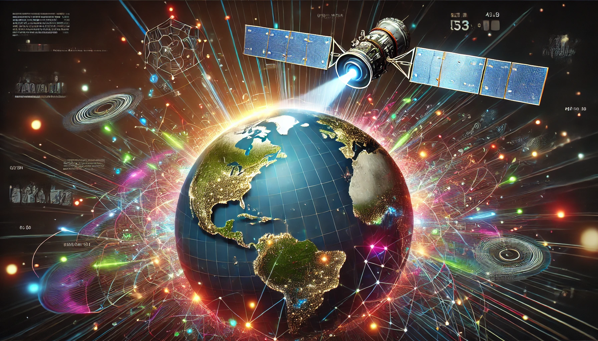

# Satellite Image Generation with LoRA



## Overview

This project leverages **Stable Diffusion** enhanced with **LoRA (Low-Rank Adaptation)** to generate high-quality satellite images based on user-provided text descriptions. It is designed to train models on custom satellite image datasets, enabling the creation of realistic images for various applications such as environmental monitoring and urban planning.

## Features

- **Text-to-Image Generation:** Create detailed satellite images from textual descriptions.
- **Data Preprocessing:** Split large images and masks into manageable 512x512 pixel sections and filter based on annotation quality thresholds.
- **LoRA Integration:** Enhance Stable Diffusion models efficiently with minimal computational overhead.
- **Advanced Augmentation:** Apply sophisticated data augmentation techniques to improve model robustness and performance.
- **YOLO Integration:** Utilize the YOLO object detection model for accurate identification of unauthorized activities in generated images.
- **Continuous Operation:** A seamlessly running video demonstration showcasing the project in action.

## Technologies Used

- **Stable Diffusion:** For generating high-resolution synthetic satellite images.
- **LoRA (Low-Rank Adaptation):** To efficiently fine-tune large models.
- **YOLOv8:** Real-time object detection to identify specific features in satellite images.
- **Albumentations:** Advanced data augmentation library to enhance dataset diversity.
- **Python:** Primary programming language used for development.
- **Diffusers Library:** For model fine-tuning and image generation.

## Installation

1. **Clone the Repository:**
    ```bash
    git clone https://github.com/yourusername/satellite-image-generation.git
    cd satellite-image-generation
    ```

2. **Create a Virtual Environment:**
    ```bash
    python3 -m venv env
    source env/bin/activate
    ```

## Performance Metrics

### YOLO with LoRA Integration

| **Category**        | **Box (P)** | **mAP50** |
|---------------------|-------------|-----------|
| **All**             | 0.827       | 0.818     |
| **Clouds**          | 0.77        | 0.995     |
| **Gold**            | 0.913       | 0.718     |
| **Poisonous Water** | 0.706       | 0.67      |
| **Water**           | 0.921       | 0.891     |

## FAQ

### Q1: Why did you choose YOLOv8 for this project?
**A1:** YOLOv8 was selected for its real-time object detection capabilities, high accuracy, and versatility, making it ideal for detecting unauthorized mining activities and environmental breaches in satellite images.

### Q2: What challenges did you encounter while integrating LoRA with YOLOv8 and Stable Diffusion?
**A2:** The integration was complex, requiring a deep understanding of both model architectures and their training pipelines. We overcame these challenges by referring to comprehensive resources and optimizing our training strategies.

### Q3: Can this methodology be applied to other domains beyond gold mining detection?
**A3:** Yes, the integration of LoRA with YOLOv8 and advanced augmentation techniques can be adapted for various applications such as environmental monitoring, urban planning, agriculture, and disaster management.

### Q4: How do you ensure the quality of synthetic images generated by Stable Diffusion?
**A4:** We combine quantitative evaluations with qualitative visual inspections to ensure that the synthetic images accurately reflect real-world conditions and maintain high standards of reliability and realism.

### Q5: What inference optimization techniques did you use for Stable Diffusion?
**A5:** Techniques include efficient model loading, leveraging GPU acceleration, and implementing memory management strategies to enhance the speed and efficiency of image generation.

## Acknowledgements

- Inspired by the book *"Using Stable Diffusion with Python"* by Andrew Zhu (Shudong Zhu).
- Thanks to the developers of Stable Diffusion, LoRA, YOLOv8, and Albumentations for their invaluable tools.

